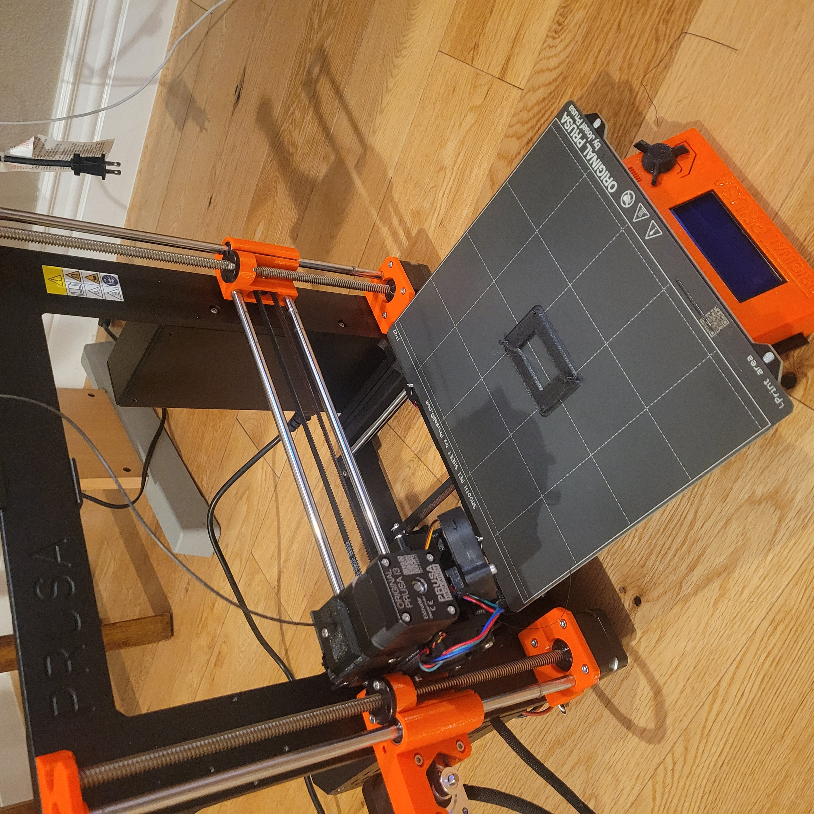
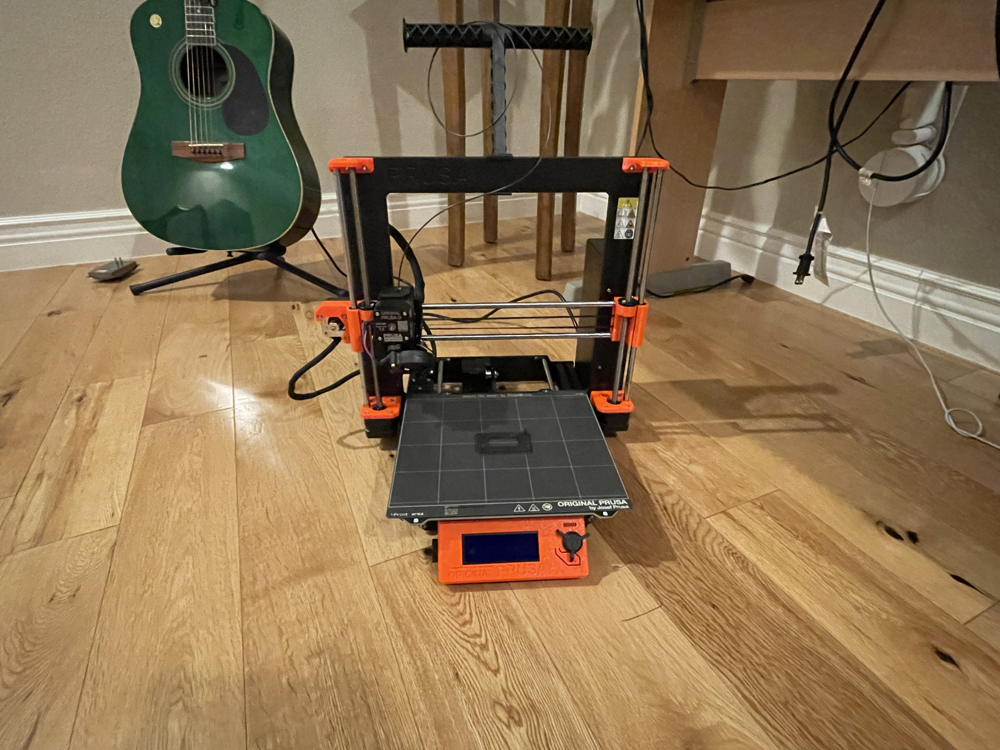
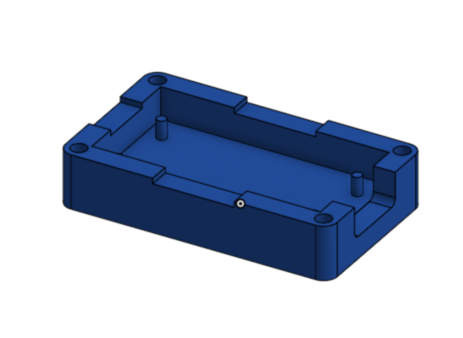
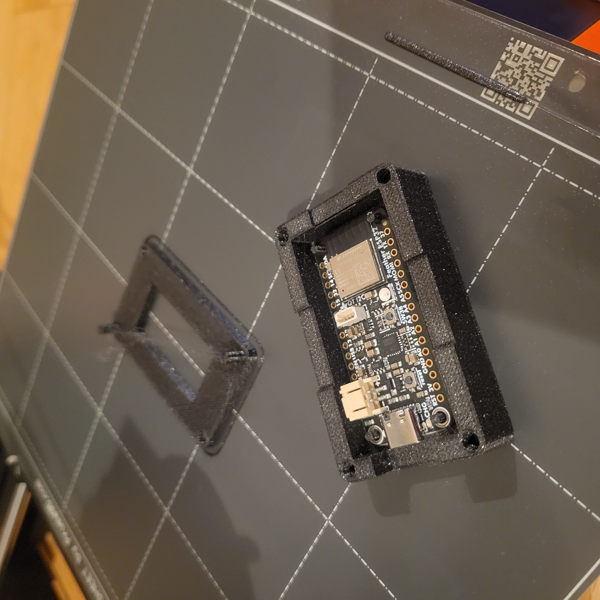
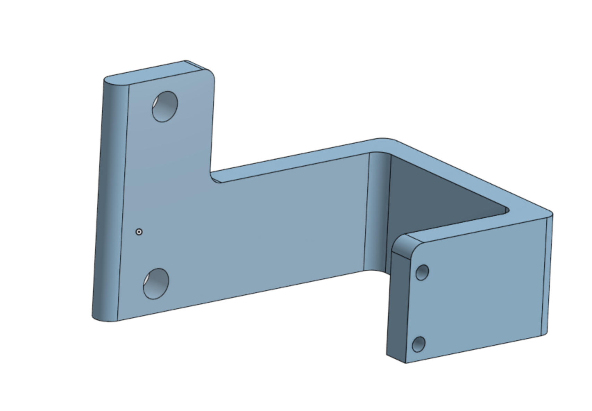
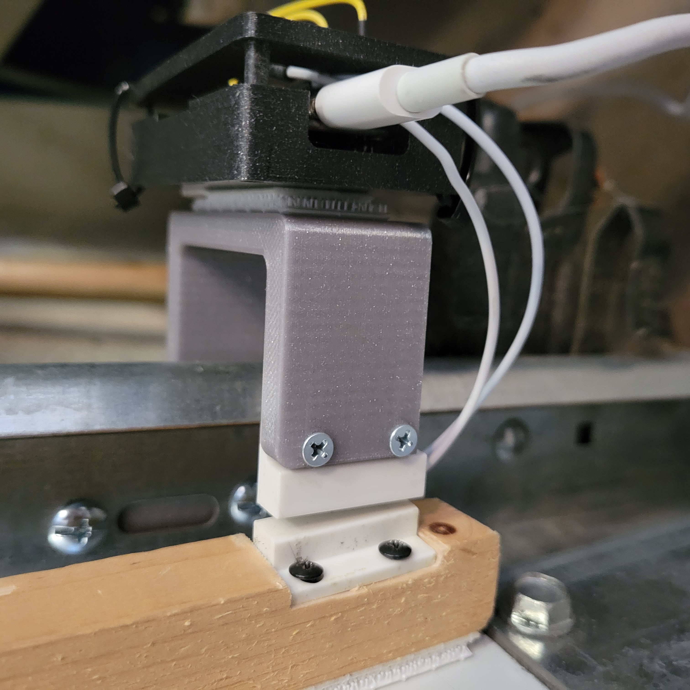
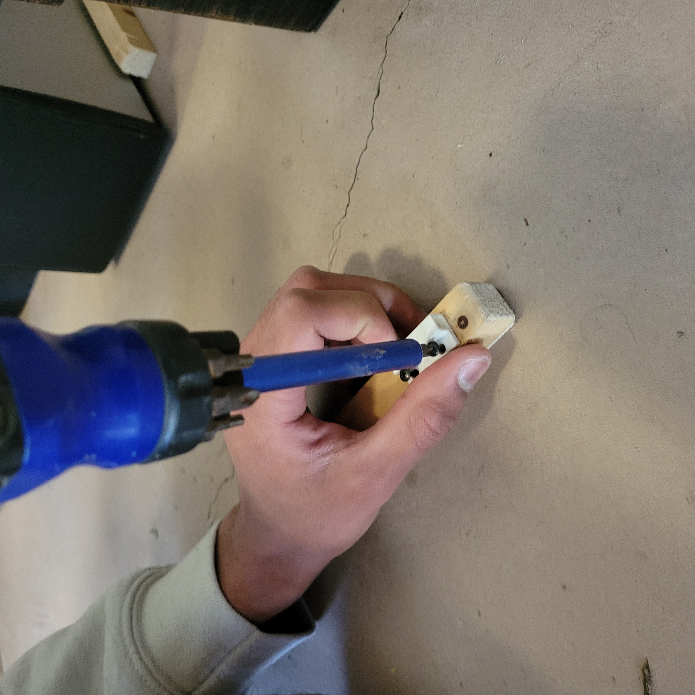
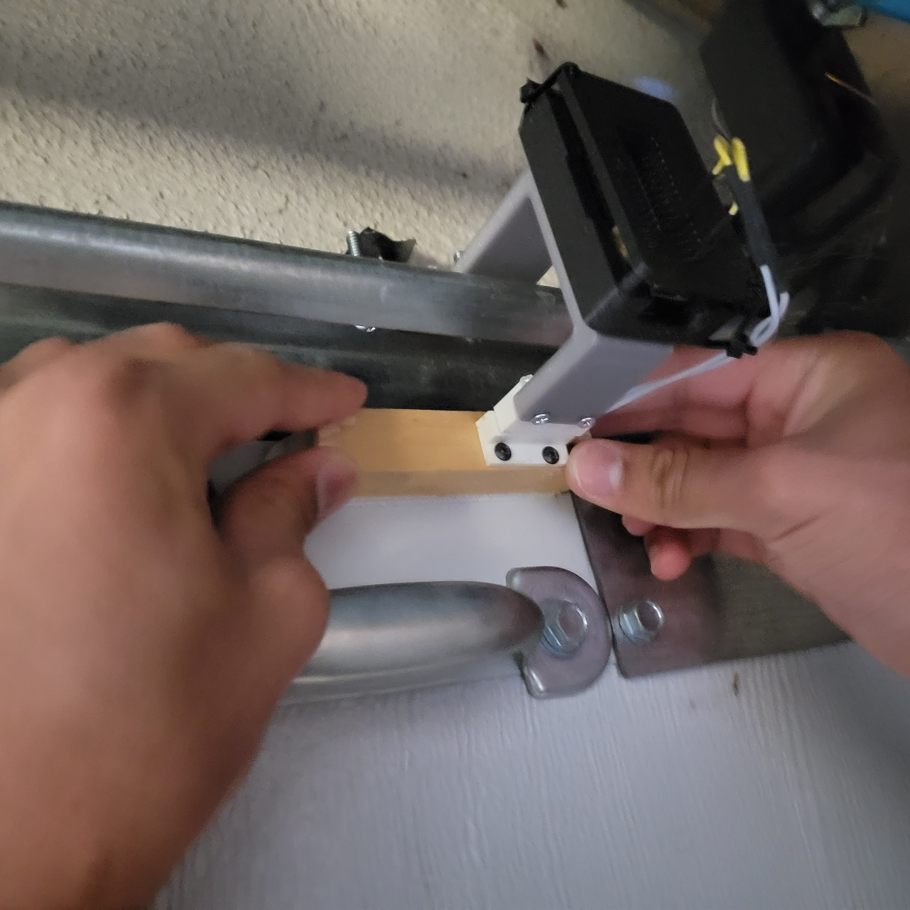

# ESP32-Garage-Door-Sensor

Whenever I step inside the house after playing basketball in my driveway, my parents always ask me: "Did you close the garage door?" It's always a painful and unnecessary task for me to go back and check, so I decided to do something to end this chronic misery. 

Using an ESP32 microcontroller, along with a Reed Switch, I decided to create a garage door notification system, in which I would be notified whenever the state of the garage door changes (ex. from open to closed or vice versa). 

## Hardware
In January, I began building my new Prusa MK3s+ 3D Printer. However, me being the busy junior I am, I never got a chance to finish it. So, I spent the first day of my Spring Break racing to finish the printer. And finally, at 1 in the morning on the Sunday before break week, it was ready to go.

  
  

Since the garage (especially the specific corner of the garage) always gets dusty fast, and to protect the ESP32 in general, my first priority was to create a case for the ESP32 in order to ensure it was shielded from the elements. I used onshape to CAD a 3D printed case for it (left), and then set my new 3D printer to work. I was quite impressed with how well the parts were printed, esepecially with the engraved "ESP32" on the cover. They both turned out great! (right)

  
  

Next, I wanted a mounting system that provided a mounting platform for the ESP32 case and the wired half of the Reed Switch. I CADded a mounting system that achieved these goals while also fitting the size constraints needed to fit in the small corner of the door. In order to mount the ESP32 and case to the mounting system, I decided to put a 3M velcro lock.

  
  

Finally, in order to make sure the unwired portion of the sensor is close to the wired portion of the sensor to avoid sensor misreadings, I used a wood block and mounted the unwired part of the sensor onto it with two wood screws to hold it in place.

  
  

With the hardware done, it was time to move onto the electrical and software components of the project.

## Electrical

Power is delivered to the ESP32 through a USB type C cable connected to a wall outlet. In initial testing, I found that the ESP32's built in pull-down resistor was not working effectively, causing false readings and false outputs when reading the reed switch value from pin 34. To fix this, I added a 100 kilo-Ohm resistor between the pin and the ground pin, which ulitmately proved to be effective.

  

## Software
I wanted the ESP32 to send a WhatsApp message to my phone whenever it detects a change in the state of the door. So, I decided to create a continuous loop that compares a prior state to a current state, and sends a message to my phone when the prior and current state differ. The two possible states in this situation are an open door and a closed door . In addition to sending a message to my phone, the ESP32 gives a visual indicator as to whether it detects a closed or open door state through controllng its neopixel. The neopixel LED blinks green if it detects a closed door, and a flashes red if it detects an open door. Finally, in order to send messages from the ESP32 to my phone, the program on the microcontroller connects to the home Wifi to access the internet, and uses CallMeBot's API in order to send the message to my phone.

Looking at the pinout diagram on the ESP32 (from the Adafruit website https://learn.adafruit.com/adafruit-esp32-feather-v2/pinouts) I used pin 2 to control the power and color of the Neopixel LED on the ESP32, and pin 34 to read from the Reed Switch. 

## Testing!!
Click on the image below to view the video
  

## References

- https://docs.micropython.org/en/latest/search.html?q=neopixel&check_keywords=yes&area=default
- https://learn.adafruit.com/adafruit-esp32-feather-v2/pinouts
- https://www.callmebot.com/blog/free-api-whatsapp-messages/
